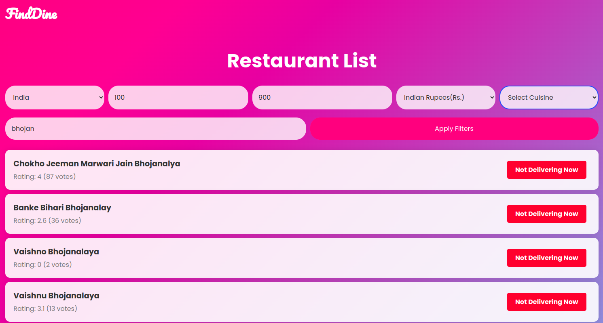
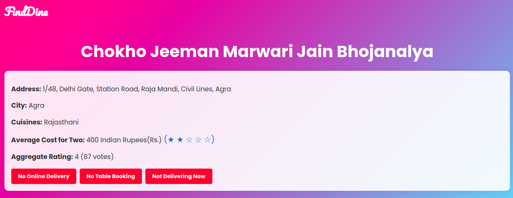

# FindDine

### Overview

FindDine is a full-stack web application that manages and searches through restaurant listings using Zomato's dataset. Broadly, it allows users to view detailed information about prospective restaurants, such as their location, cuisine, ratings, availability etc. It also allows users to search for restaurants by name, cuisine, location, price etc., or a combination of these.







### Demo Video

An execution and demonstration video of the web application is available at the following link:

https://drive.google.com/file/d/1EJ8ZU04CRCtsxQPTy4Z-W3aFn8qPqV79/view


### Tech Stack

The application utilizes the following technologies:
- Flask (Python) for the backend
- React (JavaScript) for the frontend
- SQLite for the database


### Prerequisites

- Python 3.7 or higher
- Node.js
- npm
- SQLite


### Execution

1. Clone the repository
    ```
    git clone https://github.com/e42-typeface-ai/tf-round-2-assign-Nitin-Rajasekar.git
    ````


2. Navigate to the 'Backend' directory

    ```
    cd tf-round-2-assign-Nitin-Rajasekar
    cd backend

    ```

3. Create a virtual environment

    ```
    python3 -m venv venv
    source venv/bin/activate (if you are using a Unix-based system)
    venv\Scripts\activate (if you are using a Windows system)
    ```

4. Install the required packages
    Run the following command:
    ```
    pip install -r requirements.txt
    ```
5. Run the Flask server
    Run the following command:
    ```
    python app.py
    ```
6. Navigate to the 'Frontend' directory
    ```
    cd ../frontend
    ```
7. Install the required packages
    Run the following command:
    ```
    npm install
    ```
8. Run the React server
    Run the following command:
    ```
    npm start
    ```
9. Open your browser and navigate to 'http://localhost:3000/'


### Handling Key Use Cases

- An independent script to load the zomato data into the SQLite database is located at backend/load_data.py. 
- The Web API Service to serve the loaded content is located at backend/app.py.
- The user interface for the Restaurant List Page and Restaurant Detail Page may be accessed at frontend/src/components/RestaurantListPage.js and frontend/src/components/RestaurantDetailPage.js respectively.

### Acknowledgements

I would like to thank Typeface for providing the opportunity to work on this project.


